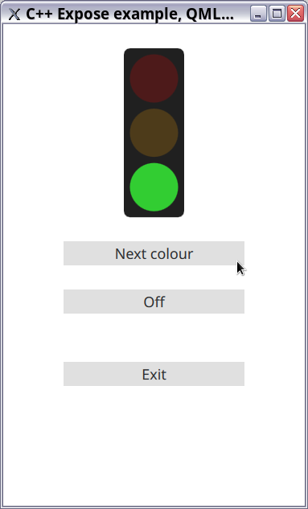
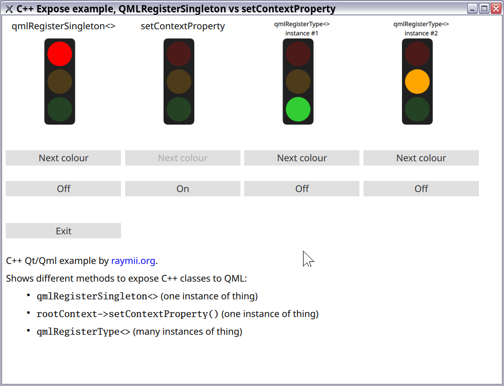

# QML Traffic Light example to show how to expose C++ classes to QML

In this article I'm going to discuss the different ways to expose a C++ class
to QML.  QML is a markup language (part of the QT framework) like HTML/CSS,
with inline JavaScript that can interact with the C++ code of your
(QT) application. There are multiple ways to expose a C++ class to QML, each
with their own benefits and quirks. This guide will cover three integration
methods, `qmlRegisterSingletonType<>`, `rootContext->setContextProperty()` 
and `qmlRegisterType<>`. We'll end off with a simple benchmark showing the
difference in startup times between the first two. 

Please read the article on my website: https://raymii.org/s/articles/Qt_QML_Integrate_Cpp_with_QML_and_why_ContextProperties_are_bad.html